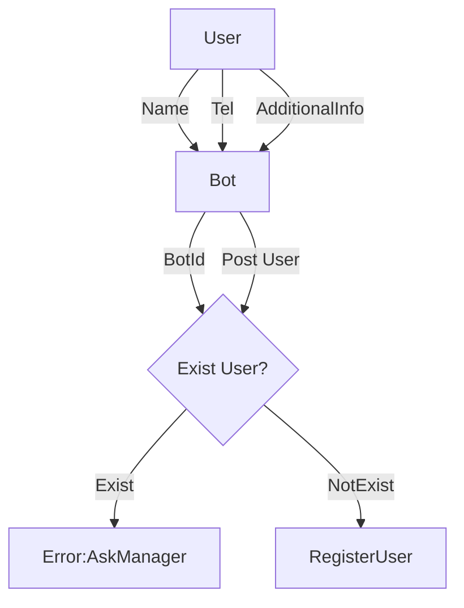
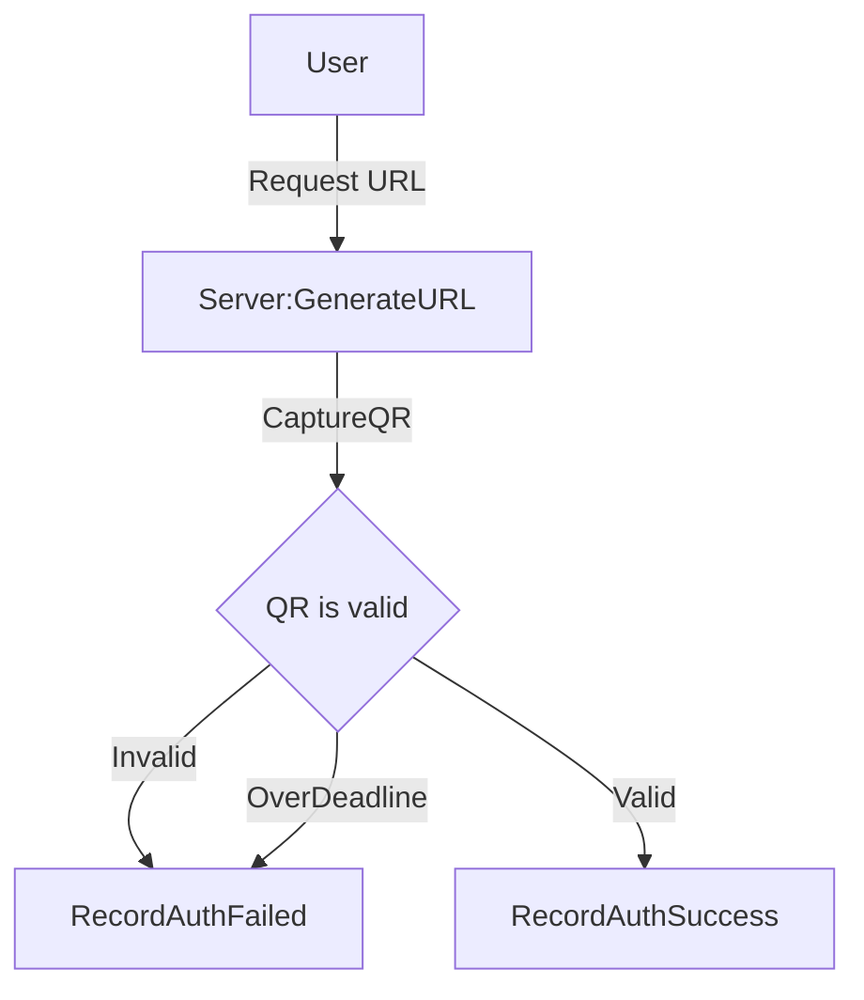

### 사용자 입장의 가입 로직

```mermaid
flowchart TD
    User -->|Name| Bot
    User -->|Tel| Bot
    User -->|AdditionalInfo| Bot
    Bot -->|BotId| Server
    Bot -->|Post User| Server{Exist User?}
    Server -->|Exist| Error:AskManager
    Server -->|NotExist| RegisterUser
```

### 사용자 입장의 인증 로직

```mermaid
flowchart TD
    User -->|Request URL| Server:GenerateURL
    Server:GenerateURL -->|CaptureQR| /api/user/qr{QR is valid}
    /api/user/qr -->|Invalid| RecordAuthFailed
    /api/user/qr -->|OverDeadline| RecordAuthFailed
    /api/user/qr -->|Valid| RecordAuthSuccess
```

### 사용자 정보 테이블
